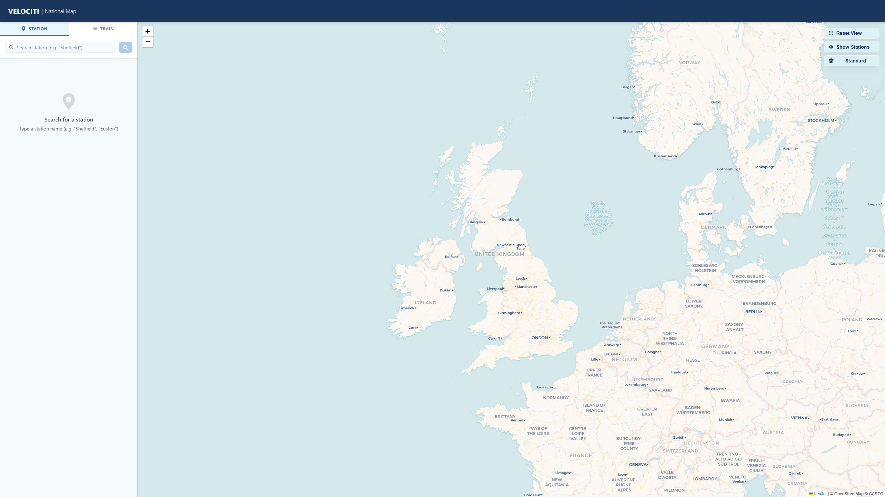
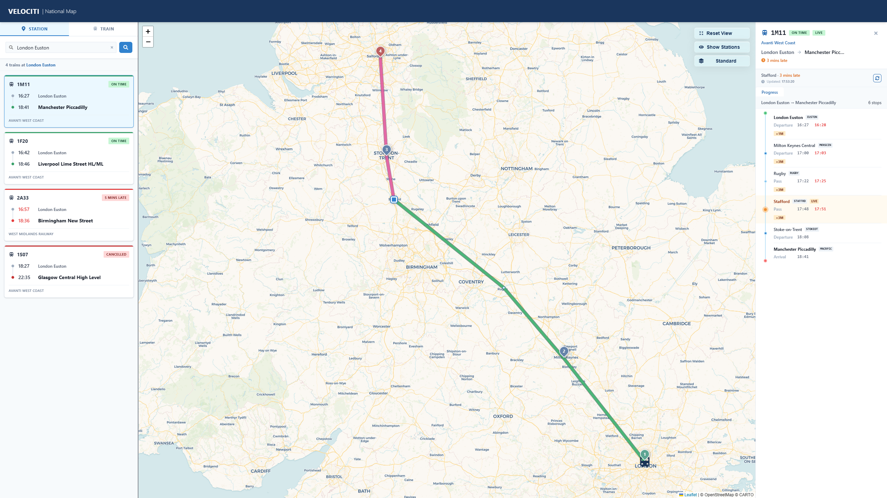
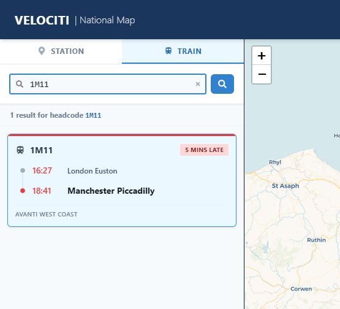
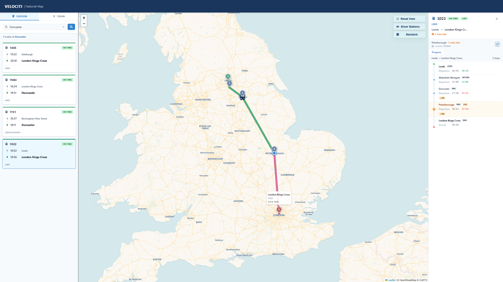
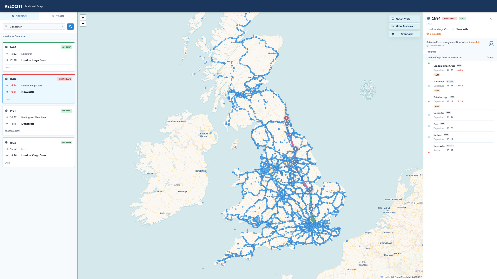
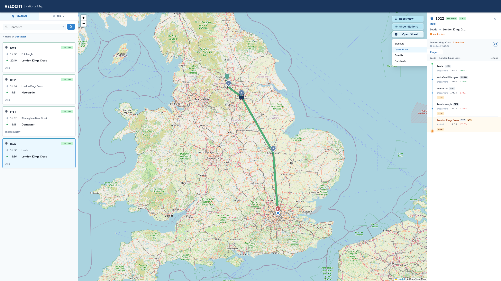
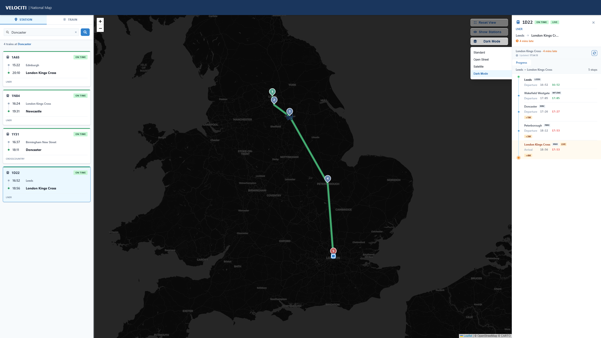

# VELOCITI National Map

VELOCITI is a React and Leaflet national rail map for exploring UK train movements, station schedules, route progress, and live service status. The application combines station and train search with an interactive map, route visualisation, map layer controls, and a train detail panel that shows scheduled and actual journey progress.

The project is built as a Vite frontend with an optional Express and Socket.IO server for live train update polling.

## Contents

- [Features](#features)
- [Screenshots](#screenshots)
- [Tech stack](#tech-stack)
- [Project structure](#project-structure)
- [Prerequisites](#prerequisites)
- [Environment variables](#environment-variables)
- [Running the project](#running-the-project)
- [Testing](#testing)
- [Troubleshooting](#troubleshooting)

## Features

### Search and discovery

- Station search mode for searching by station name or TIPLOC.
- Train search mode for searching by headcode.
- Autocomplete station suggestions backed by the local TIPLOC dataset.
- Station search results with active train cards, departure and arrival times, operator names, and status badges.
- Headcode search results prioritised by exact match and scheduled departure time.
- Empty-state messaging when no active trains are found for a searched location.

### Interactive national map

- Leaflet map centred on the UK by default.
- Automatic map navigation to searched stations.
- Route fitting when a train is selected.
- Numbered station pins for origin, intermediate stops, and destination.
- Pass-through timing points rendered as smaller route markers.
- Current train position marker when live coordinates or matched movement data are available.
- Station marker overlay for the full TIPLOC network.
- Clickable station markers that trigger station search from the map.

### Train route and progress visualisation

- Full train route fetched from the train schedule endpoint.
- Completed route segment shown separately from the remaining route.
- Fallback route rendering between origin and destination if detailed route data is unavailable.
- Route tooltips showing location names, TIPLOCs, and scheduled times.

### Live train data

- Socket.IO live-update support for the currently selected train.
- Live status badges such as `LIVE`, `CONNECTING`, `RECONNECTING`, `DISCONNECTED`, and `LIVE ERROR`.
- Automatic merge of live movement data into the selected train card and detail panel.
- Last updated timestamp in the detail panel.
- Manual refresh button for train detail data.

### Train detail panel

- Headcode, operator, live status, and train status summary.
- Origin-to-destination journey summary.
- Delay indicators for late-running trains.
- Timeline view showing scheduled time, actual time, pass/departure/arrival type, and delay variation.
- Fallback timeline if the schedule endpoint returns no stops.
- Close/back behaviour for desktop and mobile layouts.

### Map controls and layers

- Reset View button to return to the default UK-wide map.
- Show Stations / Hide Stations toggle for the TIPLOC marker layer.
- Map layer switcher with:
  - Standard
  - Open Street
  - Satellite
  - Dark Mode

## Screenshots

The screenshots below are stored in `docs/screenshots/` and demonstrate the main user-facing features.

### National Map Home

Initial national map view with dual search modes station/train, and map controls



### Station Search, Route Map, and Detail Panel

Station search results for London Euston, a selected train route on the map, and the live train detail panel.



### Train Search Mode

Headcode search mode showing a direct train result and late-running status.



### Route Progress on the Map

Selected train route with numbered stops, current train position, completed route, remaining route, and the journey timeline.



### Station Marker Overlay

Station overlay enabled, showing the wider rail network as TIPLOC markers. Clicking a marker triggers an automated search for the TIPLOC.



### Open Street Layer

Open Street basemap selected from the layer menu.



### Dark Mode Layer

Map layer selector with the Dark Mode basemap active.



## Tech Stack

- React
- TypeScript
- Vite
- ChakraUI V2
- Leaflet and React Leaflet
- Socket.io and Socket.io Client
- ExpressJs
- React Testing Library
- Jest
- ts-jest

## Project Structure

```text
VELOCITI/
|-- docs/
|   `-- screenshots/              # README feature screenshots
|-- public/                       # Static public files
|-- src/
|   |-- api/                      # Rail data API client
|   |-- assets/                   # App image assets
|   |-- components/
|   |   |-- map/                  # Leaflet map, layers, route rendering, controls
|   |   |-- mobile/               # Mobile layout components
|   |   |-- panel/                # Train detail panel and timeline
|   |   `-- sidebar/              # Search UI and train results
|   |-- data/                     # Local TIPLOC dataset and lookup helpers
|   |-- hooks/                    # Live selected train socket hook
|   |-- tests/                    # Jest unit tests
|   |-- utils/                    # Train status and time helpers
|   |-- App.tsx                   # Main app
|   |-- layout.tsx                # Main layout structure desktop/mobile
|   |-- main.tsx                  # React entry point with ChakraUI provider
|   |-- theme.ts                  # Shared colours and Chakra theme
|   `-- types.ts                  # Shared TypeScript interfaces
|-- server.js                     # Production server and Socket.IO live polling
|-- TESTING_NOTES.md              # Detailed Jest testing plan
|-- jest.config.cjs               # Jest configuration
|-- package.json                  # Scripts and dependencies
`-- vite.config.ts                # Vite configuration
```

## How to Run the Project

Install the following before running the project:

- Node.js 18 or later
- npm
- A VELOCITI / RailSmart API key for live API-backed functionality

The project has been verified with Node 24, but the `package.json` engine requires Node 18 or later.

## Environment Variables

Create a `.env` file in the project root for local development.

```bash
VITE_VELOCITI_API_KEY=your_api_key_here
VITE_VELOCITI_SOCKET_URL=http://localhost:3001
```

For the Express live-update server, the server can also read these variables:

```bash
VELOCITI_API_KEY=your_api_key_here
VELOCITI_API_BASE_URL=https://traindata-stag-api.railsmart.io
PORT=3001
```

Notes:

- `VITE_VELOCITI_API_KEY` is used by the Vite frontend API client.
- `VITE_VELOCITI_SOCKET_URL` enables live train updates in the frontend.
- `VELOCITI_API_KEY` is used by `server.js` when polling live schedule and movement data.
- Do not commit real API keys to version control.

## Running the Project

### 1. Install dependencies

```bash
npm install
```

If PowerShell blocks `npm`, use the Windows command shim:

```bash
npm.cmd install
```

### 2. Start the Vite frontend

```bash
npm run dev
```

The frontend usually opens at:

```text
http://localhost:5173
```

### 3. Start the live-update server

In a second terminal, run:

```bash
node --env-file=.env server.js
```

The server runs on:

```text
http://localhost:3001
```

The frontend can still load without the Socket.IO server, but live train updates will show as unavailable if `VITE_VELOCITI_SOCKET_URL` is not configured.

### 4. Production build

```bash
npm run build
```

### 5. Run the production server

After building, start the Express server:

```bash
npm start
```

This serves the built `dist/` frontend and hosts the Socket.IO live-update endpoint.

### 6. Preview the Vite build only

```bash
npm run preview
```

Use this for checking the static build locally. Use `npm start` when you also need the Express live-update server.

## Testing

Run all Jest unit tests:

```bash
npm test
```

Run tests in watch mode:

```bash
npm run test:watch
```

The project includes unit tests for:

- API request normalisation and error handling
- Time formatting and train status rules
- Journey timeline construction
- Search bar interactions
- Live selected train update merging

See `TESTING_PLAN.md` for the full testing plan, scope, quality gate, and future testing recommendations.

## Troubleshooting

### `npm` is blocked in PowerShell

On some Windows machines, PowerShell blocks `npm.ps1` with an execution policy error.

Use:

```bash
npm.cmd install
npm.cmd run dev
npm.cmd test
```

Or run commands from Command Prompt instead of PowerShell.

### Missing `node_modules` or Jest cannot be found

If `npm test` fails with a missing Jest module, dependencies have not been installed.

Run:

```bash
npm install
```

For a clean install from the lockfile:

```bash
npm ci
```

### API requests fail or return empty data

Check that:

- `.env` exists in the project root.
- `VITE_VELOCITI_API_KEY` is set.
- The API key is valid.
- The external train data API is reachable from your network.
- The station or headcode searched has active data for the current service day.

### Live status shows `LIVE UNAVAILABLE`

This normally means the frontend does not have a socket URL.

Check:

```bash
VITE_VELOCITI_SOCKET_URL=http://localhost:3001
```

Then restart the Vite dev server. Vite only reads environment variables when the dev server starts.

### Live status shows `LIVE ERROR`

Check that:

- `node --env-file=.env server.js` is running.
- `VELOCITI_API_KEY` or `VITE_VELOCITI_API_KEY` is available to the server.
- The selected train has valid `activationId` and `scheduleId`.
- The train schedule and movement endpoints are returning data.

### Map tiles do not load

The map depends on third-party tile providers including CARTO, OpenStreetMap, and Esri.

Check that:

- The browser has internet access.
- Ad blockers or privacy extensions are not blocking tile URLs.
- The selected layer provider is reachable.
- Browser console errors do not show blocked mixed-content or CORS errors.

### The map appears blank or grey

Try:

- Refreshing the page.
- Waiting for the map spinner to complete.
- Clicking Reset View.
- Checking the browser console for Leaflet or tile-provider errors.
- Ensuring the map container has a visible height if layout code has been changed.

### No active trains found

This can be a valid state. Some TIPLOCs may not have active passenger services in the API response for the current day, and some searches may target stations or locations with no current trains.

Try a major station such as:

- London Euston
- Manchester Piccadilly
- Leeds

### Vite build fails with `spawn EPERM`

This can happen on Windows if antivirus, permissions, or sandboxing blocks the esbuild child process.

Try:

- Running the terminal as a normal local user outside restrictive sandboxing.
- Closing file watchers or editors that may be locking build files.
- Reinstalling dependencies with `npm ci`.
- Checking antivirus quarantine/history for `esbuild`.

### Large chunk warning during build

Vite may warn that the production JavaScript bundle is larger than 500 kB. This is currently expected because the app includes mapping libraries and a large local TIPLOC dataset.
